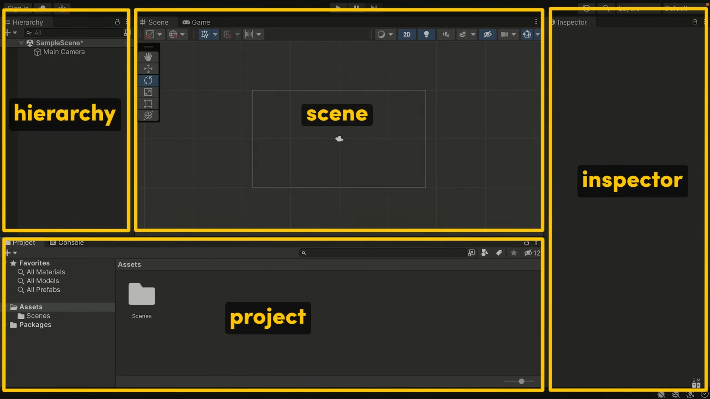
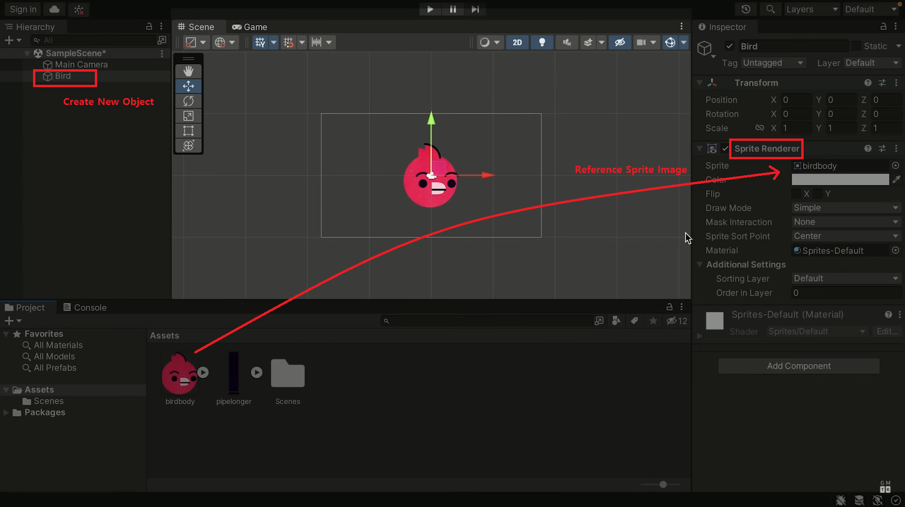
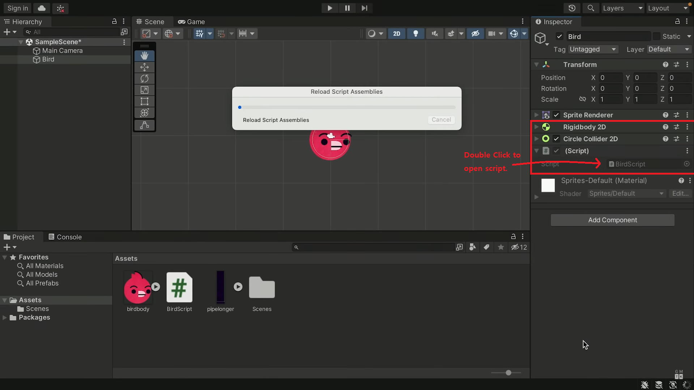
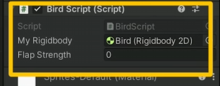

# Flappy Clone V1 development log

Goal: create basic flappy bird with bird, pipe, scoreboard UI and end screen.

Clone Coding following [GMTK's Unity tutorisl](https://www.youtube.com/watch?v=XtQMytORBmM)

---

## 1. Understanding Unity Layout

<div align="center">
  
</div>

1. **Project Window**: Contains all assets used in the game, both internal(Unity) and external.
   Examples: sprites, sound effects, scripts, tilemaps, fonts, etc.

2. **Hierarchy Window**: Lists all game objects present in the active scene/level.

   > **_Game Objects_**: Fundamental building blocks in Unity, which act as containers for components.
   > Each game object has properties such as position, rotation, and scale.
   > Examples of game objects: cameras, sprites, UI elements, and scenes.

3. **Inspector**: Displays and allows editing of the properties and components attached to the selected game object.
   Examples: add/modify components such as sprites, colliders, rigidbodies, custom scripts etc

4. **Scene**: Provides visual representation of the current scene or level.

## 2. Create Bird

<div align="center">
  
</div>

1. Import/Create Bird and add it to **Project Window**.

2. Create **New Object** in **Hierarchy** and in **Inspector** add new component **Sprite Renderer**. Drag Bird Sprite from **Assets(Project Window)** and drag it to Sprite field(game object now references Bird Sprite in Assets).

<div align="center">
  
</div>

3.  To Bird, add component **Rigidbody2D** -> now when run the Bird will fall downwards and out of frame.

    - Rigidbody2D turns object into physics object with gravity

4.  To Bird, add component Collider- **Circle Collider 2D** and adjust collider to preference.

    - Collider allows object to interact with other objects

5.  To Bird, add new Script(ex: BirdScript) and double click to open VS.

  > ### Coding
  >
  > ```csharp
  > using UnityEngine;
  >
  > public class BirdScript : MonoBehaviour
  > {
  >     // Start is called once before the first execution of Update after the MonoBehaviour is created
  >     void Start() {
  >     }
  >
  >     // Update is called once per frame
  >     void Update() {
  >     }
  > }
  > ```
  >
  > Other functions may be created to be called and executed in both existing or other scripts.  
  > References may be needed to access and modify certain values/properties.

6. Add upward velocity when space is pressed.
   
   **6-1.** Initially script can only 'talk' to game object's top bit(name, tag, layer etc) and the Transform component -> need to create reference.

         ```csharp
      
         public class BirdScript : MonoBehaviour
         {
         //references that can be accessed/modified from unity
         public Rigidbody2D myRigidbody; // gives script access to values in Rigidbody2d
      
         void Start() {
         ```
         -> Script component now has field for Ridibody 2D. Dragging Rigidbody 2D component will assign reference.

   **6.2.** Assign velocity when space is pressed.

         - Keyboard Input: Input.GetKeyDown(KeyCode._key name here_)
         - change velocity: myRigidbody (reference name from 6-1) . linearVelocity (vector for velocity direction) = _vector value_ (Vector2._direction_ is shorthand for vector direction - ex: Vector2.up == (0,1))
         - allow ease of testing and value changes create _public float flapStrength_ to change values in Unity Window
            <div align="center">
               
            </div>
        
         ```csharp
         public float flapStrength; // preferably place above void Start()
        
         void Update() {
         if (Input.GetKeyDown(KeyCode.Space) == true) //Input.GetKeyDown(KeyCode.Space)
         {
         myRigidbody.linearVelocity = Vector2.up \* flapStrength; //Vector2.up == (0,1) -> changes velocity to move towards (0,1) of current position (times flapStrength)
         }
         }
         ```
